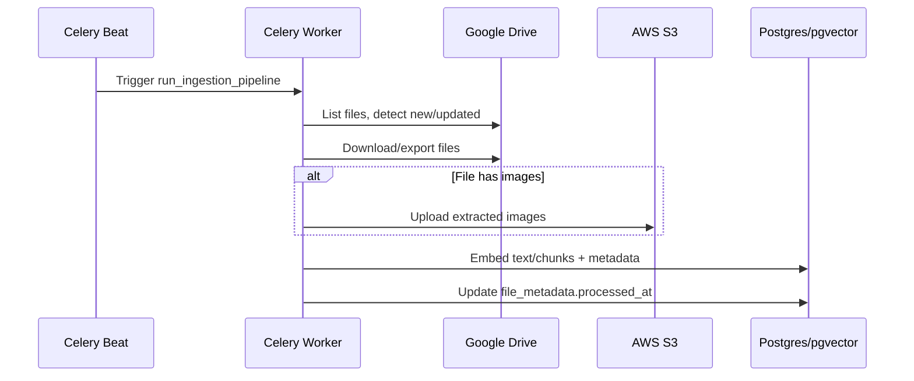

# Document Processing RAG System

A production-ready document processing and retrieval system built with FastAPI and LangChain, featuring automated ingestion into PostgreSQL `pgvector`, agentic RAG for Q&A and summarization, and multi-channel interfaces (API, Streamlit, SMS, Email).

## Features

- **Document Processing**: Automated ingestion and processing of documents from various sources
- **Vector Database**: PostgreSQL with pgvector for efficient semantic search
- **Multiple Interfaces**: API, SMS (via Twilio), Email, and Streamlit UI
- **Asynchronous Processing**: Celery for task scheduling and background processing
- **Cloud Integration**: AWS S3 for storage and Google Drive for document retrieval
 - **Auto Data Ingestion to pgvector**: Scheduled pipelines fetch from Google Drive and Gmail, extract text and images, generate embeddings, and upsert them into `pgvector` automatically
 - **AI Agent Capabilities**: Tool-using RAG agent for chat, document Q&A, summarization, and workflow automation across API/Streamlit/SMS/Email

## Project Structure

```
├── app/                      # Main application directory
│   ├── api/                  # API endpoints and routers
│   ├── core/                 # Core configuration and settings
│   ├── data_ingestion/       # Document ingestion pipelines
│   ├── database/             # Database models and connections
│   ├── evaluation/           # System evaluation tools
│   ├── reports/              # Reporting functionality
│   ├── services/             # Business logic services
│   ├── streamlit_app/        # Streamlit UI application
│   └── tasks/                # Celery tasks
├── docker/                   # Docker configuration files
├── scripts/                  # Utility scripts
├── .env.example              # Example environment variables
├── Dockerfile                # Docker build configuration
├── pyproject.toml            # Poetry dependency management
└── supervisord.conf          # Process management configuration
```

## Architecture

```mermaid
flowchart TD
  %% ===== INTERFACES =====
  subgraph Interfaces["🧭 Interfaces"]
    A1[REST API<br/>FastAPI /docs]
    A2[Streamlit UI]
    A3[Twilio SMS]
    A4[Gmail Auto-Reply]
  end

  %% ===== APPLICATION =====
  subgraph App["⚙️ Application Layer"]
    B1[FastAPI App<br/>main.py]
    B2[Agent &#40;LangChain + OpenAI&#41;]
    B3[Celery Worker]
    B4[Celery Beat]
    B5[Redis Broker]
  end

  %% ===== DATA STORES =====
  subgraph DataStores["💾 Data Stores"]
    C1[(PostgreSQL<br/>pgvector)]
    C2[(AWS S3<br/>Extracted Images)]
  end

  %% ===== EXTERNAL SERVICES =====
  subgraph External["🌐 External Services"]
    D1[Google Drive]
    D2[Gmail API]
    D3[Twilio]
    D4[OpenAI API]
  end

  %% ===== CONNECTIONS =====
  A1 --> B1
  A2 --> B1
  A3 --> B1
  A4 --> B1

  B1 <--> B2
  B1 --> B3
  B4 -. Schedules .-> B3
  B3 <--> B5

  B2 <--> C1
  B3 <--> C1
  B3 --> C2

  B3 <--> D1
  B1 <--> D2
  B1 <--> D3
  B2 <--> D4

  %% ===== STYLES =====
  classDef interface fill:#e7f3fe,stroke:#4a90e2,stroke-width:1px,color:#1a1a1a;
  classDef app fill:#fdf5e6,stroke:#f5a623,stroke-width:1px,color:#1a1a1a;
  classDef store fill:#eaf5ff,stroke:#6aa1d8,stroke-width:1px,color:#1a1a1a;
  classDef svc fill:#f6ffea,stroke:#78b36a,stroke-width:1px,color:#1a1a1a;

  class A1,A2,A3,A4 interface;
  class B1,B2,B3,B4,B5 app;
  class C1,C2 store;
  class D1,D2,D3,D4 svc;
```



### Ingestion pipeline (high level)



## Installation

1. **Clone the repository:**
   ```bash
   git clone <your-repository-url>
   cd <repository-folder>
   ```

2. **Set up environment variables:**
   Copy the example environment file and update with your credentials
   ```bash
   cp example.env .env
   # Edit .env with your configuration
   ```

3. **Install dependencies:**
   ```bash
   poetry install
   ```

## Running the Application

### Development Mode

```bash
# Start the FastAPI server
poetry run uvicorn main:app --reload

# In a separate terminal, start Celery worker
poetry run celery -A app.core.celery_app worker --loglevel=info

# In another terminal, start Celery beat for scheduled tasks
poetry run celery -A app.core.celery_app beat --loglevel=info
```

### Using Docker

```bash
# Build the Docker image
docker build -t document-rag-system .

# Run the container
docker run -d --name document-system -p 8000:8000 -p 5555:5555 document-rag-system
```

## Accessing the Application

- **API Documentation**: http://localhost:8000/docs
- **Streamlit UI**: http://localhost:8501
- **Celery Flower Dashboard**: http://localhost:5555

## Development

### Adding New Documents

The system can ingest documents from:
- Google Drive
- Email attachments
- Direct uploads

### Running Tests

```bash
poetry run pytest
```

## License

[MIT License](LICENSE)